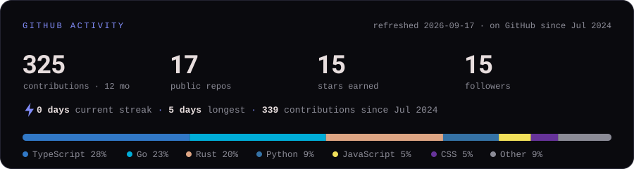

 

&nbsp;&nbsp;&nbsp;&nbsp;

 

## Hi, I'm Bilol 👋

**I build the parts of a system that are not allowed to fall over.**

Backend architect from Dushanbe, Tajikistan. Most of my time goes into Rust, Go and C: designing high-load platforms for fintech, telecom and government, then squeezing them until they run well on low-end Android phones over unstable networks. The rest goes into teaching teams how Unix, security and applied AI actually work.

- 🏢 &nbsp;**Head of Software Department** at **Azal Telecommunications** — architecture and technical enablement for enterprise and government-scale systems
- 🚀 &nbsp;**Co-Founder & CEO** at **4Byte** — a software company shipping across platforms, systems and SaaS for B2C, B2B and B2G
- ⚙️ &nbsp;**Backend Architect** at **Koinoti Nav** — Rust + Next.js, high-load systems, and a security-first Linux distribution for enterprise partners
- 🎓 &nbsp;B.Sc. Computer Science (RTSU) · CCNA · Cisco Certified Instructor · AZ-900 · AI-900

 

## Featured work

<table>
<tr>
<td width="50%" valign="top">

### 🧵 <a href="https://github.com/BillSharifzade/rs-apilib">apiweave</a>

Declare an operation once; serve it as **REST, GraphQL, JSON-RPC, SOAP, WebSocket and SSE** from a single handler. One schema IR, one validation pass, one error taxonomy, no codegen step. Ships a hand-written GraphQL parser with SDL and introspection, WSDL and OpenAPI 3.1 generation, and derive macros — with zero `*-sys` dependencies.

<code>Rust</code> · <code>hyper</code> · <code>Tokio</code> · <code>proc-macros</code>

</td>
<td width="50%" valign="top">

### 🧠 <a href="https://github.com/BillSharifzade/AutoRAG">KARAG — Auto RAG</a>

Multi-tenant, RBAC-governed AI over corporate data. Two planes kept apart: RAG retrieves and cites **text**, verified skills compute **numbers** — the model never sees raw SQL. Clearance is enforced inside the vector query, so forbidden content never reaches the context. Same code runs on an offline fake, local Ollama, or Claude.

<code>Python</code> · <code>RAG</code> · <code>RBAC</code> · <code>Ollama / Claude</code>

</td>
</tr>
<tr>
<td width="50%" valign="top">

### 🤖 <a href="https://github.com/BillSharifzade/Rust-Screenx-HR-Automatization">Screenx</a>

Recruitment platform bridging a corporate HR/ERP system, a Telegram bot and a Telegram Mini App. Carries a candidate from registration through **AI-generated testing** to hire, with background workers driving the AI queue, webhook delivery and deadlines behind Argon2 + JWT auth and per-route rate limiting.

<code>Rust</code> · <code>Axum</code> · <code>SQLx</code> · <code>PostgreSQL</code> · <code>Next.js</code> · <code>OpenAI</code>

</td>
<td width="50%" valign="top">

### 📈 <a href="https://github.com/BillSharifzade/HR_Progress">HR Progress</a>

Workforce development for a large corporation: multi-assessor scoring against a **per-grade competency matrix**, with the resulting gaps turned into Individual Development Plans, preceptor matching and predicted-improvement tracking. Built to stay extensible as competencies change.

<code>Go</code> · <code>chi</code> · <code>PostgreSQL</code> · <code>React</code> · <code>TypeScript</code>

</td>
</tr>
<tr>
<td width="50%" valign="top">

### 🗓️ <a href="https://github.com/BillSharifzade/AtS_booking">AtS Booking</a>

Room booking for a company: a Telegram bot for requesters with D-1 and H-1 reminders, a React admin panel for approvals and room CRUD, and an async FastAPI + PostgreSQL backend. One `docker compose` to run the lot.

<code>Python</code> · <code>FastAPI</code> · <code>aiogram</code> · <code>React</code> · <code>PostgreSQL</code>

</td>
<td width="50%" valign="top">

### 🌐 <a href="https://github.com/BillSharifzade/BillSharifzade.github.io">billsharifzade.github.io</a>

My portfolio and living CV. Animated React + Vite front end with the CV exported on demand to PDF, DOCX, XLSX and Markdown from a single data source, plus a build-time no-JS fallback.

<code>React</code> · <code>Vite</code> · <code>GSAP</code> · <code>react-pdf</code>

</td>
</tr>
</table>

 

## Numbers I stand behind

<table align="center">
<tr>
<td align="center" valign="top" width="25%"><h2>50–70×</h2>latency &amp; throughput gain on the Smart City platform, every change load-tested against production with Grafana k6</td>
<td align="center" valign="top" width="25%"><h2>~1000×</h2>faster regulatory reporting for a micro-credit engine: multi-day manual compilation down to minutes</td>
<td align="center" valign="top" width="25%"><h2>10+</h2>large-scale systems automating core business processes for enterprise clients</td>
<td align="center" valign="top" width="25%"><h2>80%</h2>less manual work for those clients, and hiring cut from days to hours with AI-driven screening</td>
</tr>
</table>

 

## Stack

<table>
<tr>
<td width="190"><b>Languages</b></td>
<td></td>
</tr>
<tr>
<td width="190"><b>Backend &amp; web</b></td>
<td></td>
</tr>
<tr>
<td width="190"><b>Data &amp; infra</b></td>
<td></td>
</tr>
<tr>
<td width="190"><b>Low-level, ML &amp; cloud</b></td>
<td></td>
</tr>
</table>

What I actually reach for: **Rust** with Axum, Actix, Tokio, Tauri and Ratatui · **Go** with chi and pgx · **Python** with FastAPI, Django, NumPy/Pandas and TensorFlow · **C** with OpenGL and Vulkan, plus Zig and Assembly when it matters · **Linux** all the way down: Arch, Gentoo and Kali, the kernel, systemd, syscalls.

 
 

## Activity

<picture>
  <source media="(prefers-color-scheme: dark)" srcset="assets/stats-dark.svg">
  <source media="(prefers-color-scheme: light)" srcset="assets/stats-light.svg">
  
</picture>

 

<picture>
  <source media="(prefers-color-scheme: dark)" srcset="https://raw.githubusercontent.com/BillSharifzade/BillSharifzade/output/github-snake.svg">
  <source media="(prefers-color-scheme: light)" srcset="https://raw.githubusercontent.com/BillSharifzade/BillSharifzade/output/github-snake-light.svg">
  
</picture>

Both graphics are rendered by workflows in this repo, so they never depend on a rate-limited third-party service.

 

## Off the keyboard

Astrophysics · Mathematics · Chess · Guitar · Poems · Philosophy · Bodybuilding · Knitting · the occasional round of CS2

 

The full CV, downloadable in several formats, lives at <a href="https://billsharifzade.github.io/">billsharifzade.github.io</a>. Always happy to talk systems, Rust, or hard problems — pick any channel above.

  

